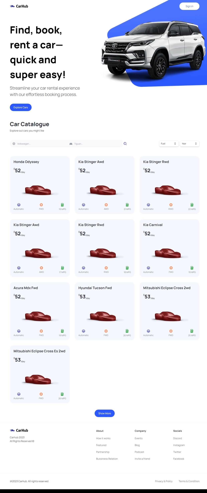

# CarHub (Next.js Demo)



## Installation

```bash
# Clone the repository
git clone https://github.com/0xAlMo3geZ/nextjs-demo.git

# Change directory to the project folder
cd nextjs-demo

# Install dependencies
npm install
```

## Usage

```bash
# Start the Server (Frontend)
npm run dev

# Access the Web Application
https://localhost:3000
```

## Project Structure

```
.
├── README.md
├── app
├── components
├── constants
├── next-env.d.ts
├── next.config.js
├── node_modules
├── package-lock.json
├── package.json
├── pages
├── photo.jpeg
├── postcss.config.js
├── public
├── tailwind.config.js
├── tsconfig.json
├── types
└── utils
```
